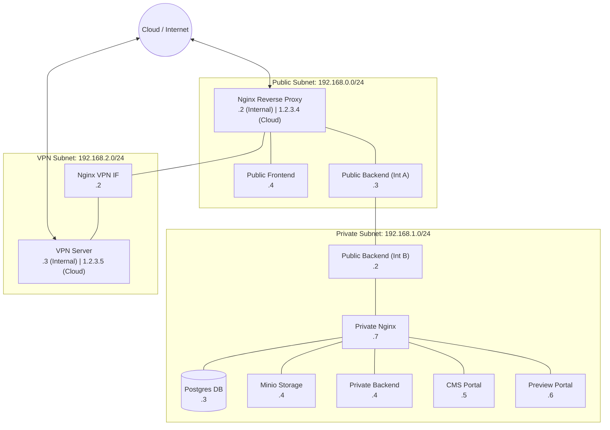

```mermaid
graph TD
    %% Internet Representation
    Cloud((Cloud / Internet))

    %% 192.168.0.0/24 - PUBLIC FACING SUBNET
    subgraph Subnet_0 [Public Subnet: 192.168.0.0/24]
        Nginx_Pub["Nginx Reverse Proxy<br/>.2 (Internal) | 1.2.3.4 (Cloud)"]
        Frontend_Pub["Public Frontend<br/>.4"]
        Backend_Pub_A["Public Backend (Int A)<br/>.3"]
    end

    %% 192.168.1.0/24 - PRIVATE BACKEND SUBNET
    subgraph Subnet_1 [Private Subnet: 192.168.1.0/24]
        Backend_Pub_B["Public Backend (Int B)<br/>.2"]
        Nginx_Priv["Private Nginx<br/>.7"]
        Postgres[("Postgres DB<br/>.3")]
        Minio["Minio Storage<br/>.4"]
        Backend_Priv["Private Backend<br/>.4"]
        CMS["CMS Portal<br/>.5"]
        Preview["Preview Portal<br/>.6"]
    end

    %% 192.168.2.0/24 - VPN SUBNET
    subgraph Subnet_2 [VPN Subnet: 192.168.2.0/24]
        Nginx_VPN["Nginx VPN IF<br/>.2"]
        VPN_Srv["VPN Server<br/>.3 (Internal) | 1.2.3.5 (Cloud)"]
    end

    %% Cloud Connections
    Cloud <--> Nginx_Pub
    Cloud <--> VPN_Srv

    %% Subnet 0 Internal Connections
    Nginx_Pub --- Frontend_Pub
    Nginx_Pub --- Backend_Pub_A

    %% Bridge between Subnet 0 and Subnet 1 via Public Backend
    Backend_Pub_A --- Backend_Pub_B

    %% Subnet 1 Internal Connections
    Backend_Pub_B --- Nginx_Priv
    Nginx_Priv --- Postgres
    Nginx_Priv --- Minio
    Nginx_Priv --- Backend_Priv
    Nginx_Priv --- CMS
    Nginx_Priv --- Preview

    %% Bridge between Subnet 0 and Subnet 2 via Nginx Proxy
    Nginx_Pub --- Nginx_VPN
    Nginx_VPN --- VPN_Srv
```
