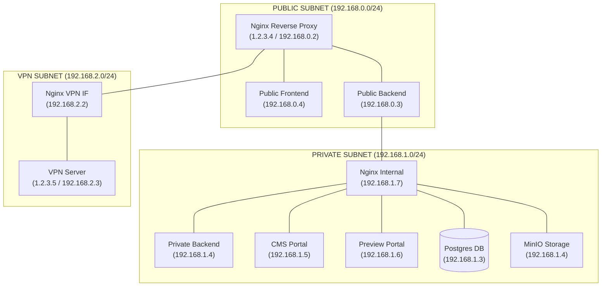

```mermaid
graph TD
    %% SUB-NET 0: PUBLIC
    subgraph PUBLIC_NET ["PUBLIC SUBNET (192.168.0.0/24)"]
        direction TB
        NGINX_RP["Nginx Reverse Proxy <br/> (1.2.3.4 / 192.168.0.2)"]
        FRONTEND_PUB["Public Frontend <br/> (192.168.0.4)"]
        BACKEND_PUB["Public Backend <br/> (192.168.0.3)"]
        
        NGINX_RP --- FRONTEND_PUB
        NGINX_RP --- BACKEND_PUB
    end

    %% SUB-NET 1: PRIVATE
    subgraph PRIVATE_NET ["PRIVATE SUBNET (192.168.1.0/24)"]
        direction TB
        NGINX_INT["Nginx Internal <br/> (192.168.1.7)"]
        BACKEND_PRI["Private Backend <br/> (192.168.1.4)"]
        CMS_PORTAL["CMS Portal <br/> (192.168.1.5)"]
        PREVIEW_PORTAL["Preview Portal <br/> (192.168.1.6)"]
        POSTGRES_DB[("Postgres DB <br/> (192.168.1.3)")]
        MINIO_S3["MinIO Storage <br/> (192.168.1.4)"]
        
        NGINX_INT --- BACKEND_PRI
        NGINX_INT --- CMS_PORTAL
        NGINX_INT --- PREVIEW_PORTAL
        NGINX_INT --- POSTGRES_DB
        NGINX_INT --- MINIO_S3
    end

    %% SUB-NET 2: VPN
    subgraph VPN_NET ["VPN SUBNET (192.168.2.0/24)"]
        direction LR
        NGINX_VPN_IF["Nginx VPN IF <br/> (192.168.2.2)"]
        VPN_GATEWAY["VPN Server <br/> (1.2.3.5 / 192.168.2.3)"]
        
        NGINX_VPN_IF --- VPN_GATEWAY
    end

    %% INTER-SUBNET CONNECTIONS
    %% Connects the Public Backend to the Private Subnet
    BACKEND_PUB --- NGINX_INT
    
    %% Connects the Main Nginx to the VPN Subnet
    NGINX_RP --- NGINX_VPN_IF
```
