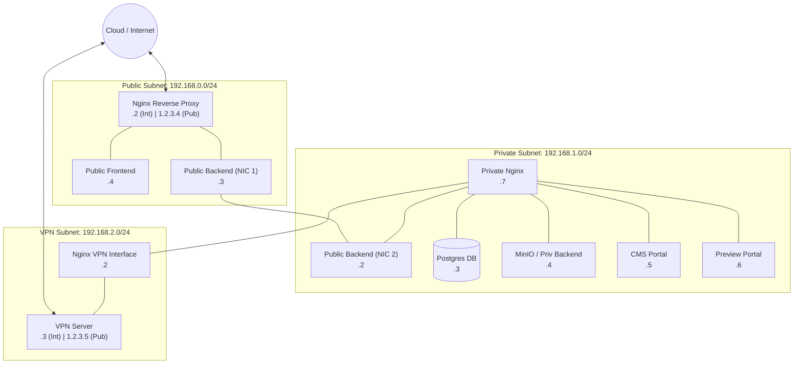

```mermaid
graph TD
    %% Internet/Cloud
    Cloud((Cloud / Internet))

    %% 192.168.0.0/24 - PUBLIC ENTRY
    subgraph Subnet_0 [Public Subnet: 192.168.0.0/24]
        direction TB
        Nginx_Pub["Nginx Reverse Proxy<br/>.2 (Int) | 1.2.3.4 (Pub)"]
        Frontend_Pub["Public Frontend<br/>.4"]
        Backend_Pub_A["Public Backend (NIC 1)<br/>.3"]
    end

    %% 192.168.1.0/24 - PRIVATE RESOURCES
    subgraph Subnet_1 [Private Subnet: 192.168.1.0/24]
        direction TB
        Backend_Pub_B["Public Backend (NIC 2)<br/>.2"]
        Nginx_Priv["Private Nginx<br/>.7"]
        Postgres[("Postgres DB<br/>.3")]
        Minio["MinIO / Priv Backend<br/>.4"]
        CMS["CMS Portal<br/>.5"]
        Preview["Preview Portal<br/>.6"]
    end

    %% 192.168.2.0/24 - VPN & MANAGEMENT
    subgraph Subnet_2 [VPN Subnet: 192.168.2.0/24]
        direction LR
        Nginx_VPN_IF["Nginx VPN Interface<br/>.2"]
        VPN_Srv["VPN Server<br/>.3 (Int) | 1.2.3.5 (Pub)"]
    end

    %% External Connections
    Cloud <--> Nginx_Pub
    Cloud <--> VPN_Srv

    %% Subnet 0 Internal
    Nginx_Pub --- Frontend_Pub
    Nginx_Pub --- Backend_Pub_A

    %% Bridge: Subnet 0 to Subnet 1
    Backend_Pub_A --- Backend_Pub_B

    %% Subnet 1 Internal (Private Nginx as the Hub)
    Nginx_Priv --- Backend_Pub_B
    Nginx_Priv --- Postgres
    Nginx_Priv --- Minio
    Nginx_Priv --- CMS
    Nginx_Priv --- Preview

    %% Bridge: Subnet 1 to Subnet 2 (Private Nginx connected to VPN)
    Nginx_Priv --- Nginx_VPN_IF
    Nginx_VPN_IF --- VPN_Srv
```
